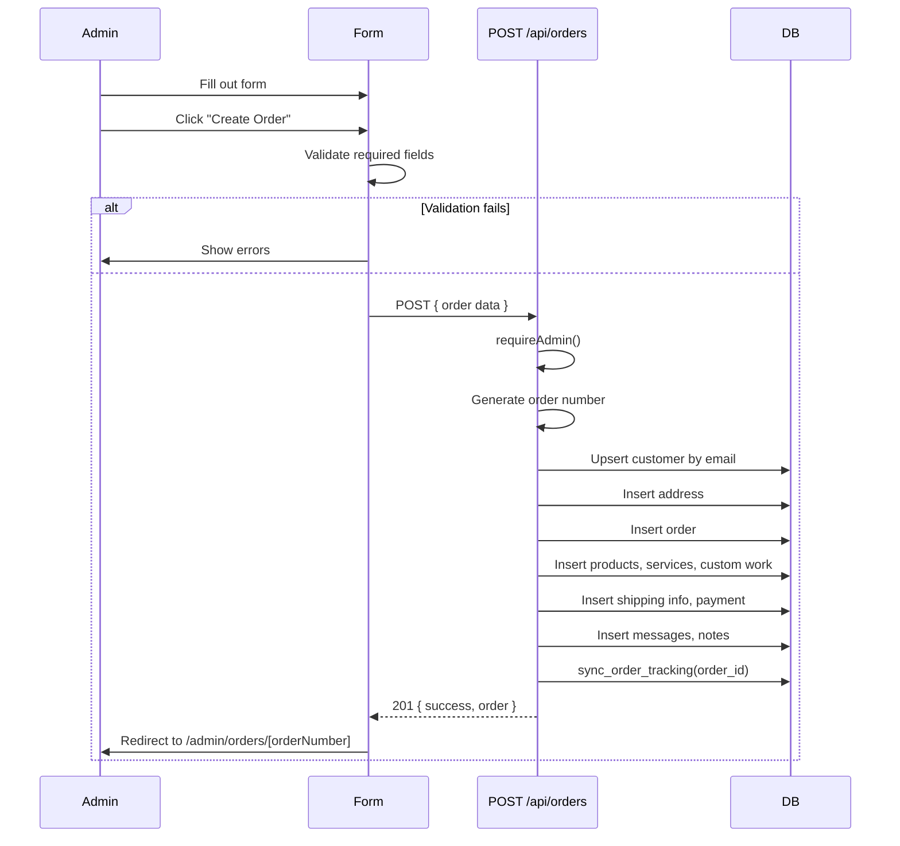

# Create Order

**Route:** `/admin/new`

**Type:** Client Component

Full order creation form. Each section is a separate component in `src/components/admin/order-form/`.

## Sections

### 1. Customer Information

`CustomerInfoSection.tsx`

| Field | Type | Required |
|-------|------|----------|
| Name | Text input | Yes |
| Email | Text input | Yes |
| Phone | Text input | Yes |
| Discord Username | Text input | No |

### 2. Shipping Address

`ShippingAddressSection.tsx`

| Field | Type | Required |
|-------|------|----------|
| Street Address | Text input | Yes |
| City | Text input | Yes |
| State | Select (Indian states) | Yes |
| Pincode | Text input | Yes |

Uses `src/constants/india-states.ts` for state options.

### 3. Products

`ProductsSection.tsx`

Add line items for products in the order:

| Field | Type |
|-------|------|
| Type | Select (product type) |
| Name | Text input |
| Sort Order | Number |

Products are stored in the `order_products` table.

### 4. Services

`ServicesSection.tsx`

Select services from the catalog defined in `src/constants/services.ts`:

- Browse by category (Keyboard, Mouse)
- Select subcategory and specific service
- Set quantity
- Each service has a base price; custom work items have negotiable pricing

Uses `SearchableSelect.tsx` for service search/filter.

### 5. Custom Work

`CustomWorkSection.tsx`

Custom work items for builds/repairs:

| Field | Type |
|-------|------|
| Name | Text |
| Category | Select (keyboard/mouse) |
| Description | Textarea |
| Price | Number |
| Sort Order | Number |

### 6. Costing / Billing

`BillingSection.tsx`

Automatically computed billing breakdown:

| Component | Source |
|-----------|--------|
| Services subtotal | `computeServicesSubtotal()` |
| Custom work subtotal | Sum of custom work prices |
| Extra charges | Manual entry (name + amount) |
| Flat discount | Manual entry (₹) |
| Percentage discount | Manual entry (%) |
| Tax % | Manual entry |
| Shipping cost | From logistics section |
| Packaging cost | From logistics section |
| **Grand total** | `computeBillingTotals()` |

### 7. Logistics

`LogisticsSection.tsx`

| Field | Type |
|-------|------|
| Shipping Status | Select (status enum) |
| Courier | Text |
| Tracking Number | Text |
| Tracking URL | URL |
| Shipping Cost | Number |
| Packaging Cost | Number |
| Est. Dispatch Date | Date picker |
| Est. Delivery Date | Date picker |

### 8. Customer Message

`CustomerMessageSection.tsx`

A textarea where the customer's message/instructions are recorded. Visible to admin.

### 9. Admin → Customer Notes

`AdminToCustomerSection.tsx`

Notes that will be visible to the customer on their tracking page. Multiple notes can be added (stored in `admin_customer_notes`).

### 10. Internal Notes

`NotesSection.tsx`

Notes visible only to admins (stored in `admin_internal_notes`). Multiple notes supported.

## Submission Flow

## Sticky Bottom Bar

A bar at the bottom of the screen shows:

- Running grand total (updated as form fields change)
- **Create Order** button (primary action)
- **Cancel** link (returns to `/admin`)

## Validation

- Customer name, email, phone are required
- State must be selected
- At least one product or service must be added (logic-level validation)
- Email format validation
- Phone number format validation
