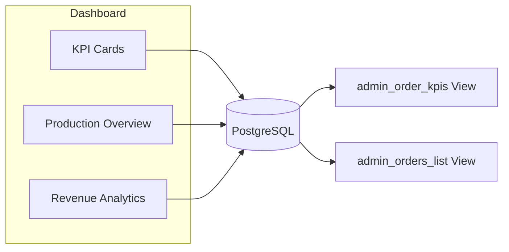
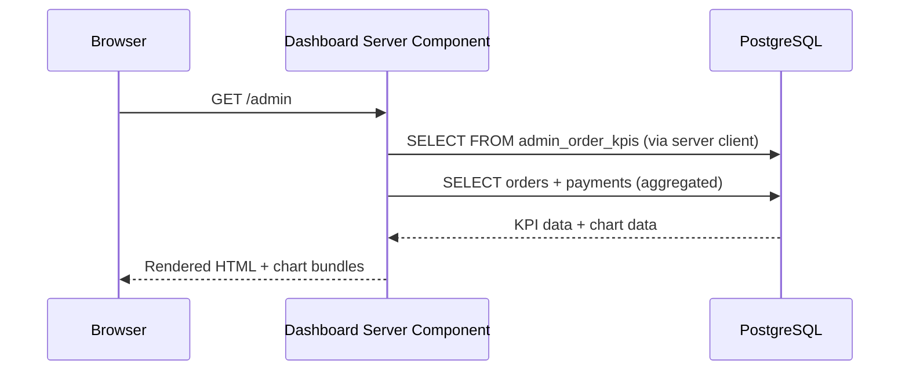

# Admin Dashboard

**Route:** `/admin`

**Type:** Server Component (`force-dynamic`)

The dashboard provides a real-time overview of the workshop's order pipeline.

## Sections

### Greeting

Displays a time-based greeting: "Good morning/afternoon/evening, Hardik" using the server time.

### KPI Cards

Four metric cards displayed in a responsive grid:

| Metric | Source | Description |
|--------|--------|-------------|
| Total Orders | `COUNT(*) from admin_orders_list` | All non-deleted orders |
| Revenue (₹) | `SUM(amount_paid)` | Total amount collected |
| Pending Orders | `COUNT(*) WHERE current_status NOT IN ('completed','cancelled')` | Orders still in progress |
| Warranty Cases | `COUNT(*) FROM warranty_records WHERE warranty_status != 'none'` | Active warranties |

Each card includes an icon (lucide-react) and color accent.

### Production Overview

A bar chart (Recharts `BarChart`) showing the breakdown of orders by production stage. Stages are defined in `src/constants/order-statuses.ts` and include:

- Order Received
- In Queue
- Parts Arranging
- Build In Progress
- Quality Check
- Photography
- Packing
- Shipped
- Delivered
- Order Completed

The chart groups statuses into stages to provide a pipeline view. X-axis shows stages, Y-axis shows order count.

### Revenue Analytics

A line/bar chart showing revenue over time with views:

- **Daily** — Last 7 days
- **Weekly** — Last 4 weeks
- **Monthly** — Last 12 months
- **Yearly** — Last 5 years

Computed from `payments.amount_paid` aggregated by the relevant time period.

### Quick Actions

- **Create Order** button → `/admin/new`

## Data Flow

