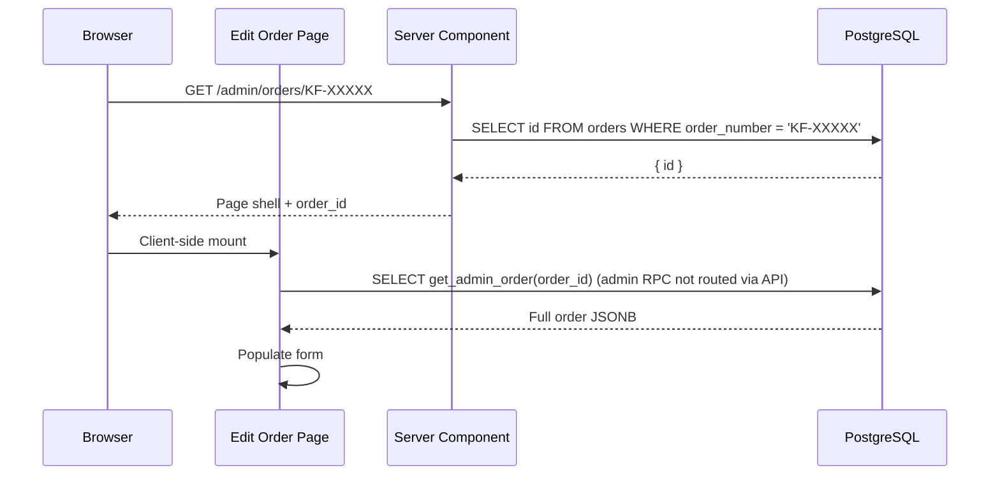

# Edit Order

**Route:** `/admin/orders/[orderNumber]`

**Type:** Client Component

Full order editing form. Shares the same component sections as Create Order, but pre-populated with existing data.

## How It Works

1. Server Component generates metadata (`order_number` in page title)
2. Client Component fetches the full order via a direct Supabase query using `get_admin_order()`
3. Form sections are populated from existing data
4. Admin makes changes and clicks **Save**
5. Only changed fields are sent to the API (delta-based saving)

## Sections

Same sections as [Create Order](./CREATE_ORDER.md), plus:

### Timeline Card

A timeline view showing all status updates for the order. Admin can add new timeline entries.

### Action Buttons (Sticky Bottom Bar)

| Button | Action |
|--------|--------|
| **Save** | PATCH `/api/orders/[id]` with delta changes |
| **Cancel** | Return to `/admin/orders` |
| **Archive** | DELETE `/api/orders/[id]` (soft-delete) |
| **View Tracking** | Opens `/track/[orderNumber]` in new tab |

## Delta-Based Saving

The form tracks which fields have changed and only sends those in the PATCH request:

```typescript
const changedFields = {
  products: only if products differ,
  services: only if services differ,
  billing: only if billing_detail changed,
  shipping: only if shipping info changed,
  // ...
}
```

This reduces payload size and prevents unnecessary database writes.

## Data Fetching



## Notes Management

- **Admin → Customer Notes** — Editable; replaces all notes on save
- **Internal Notes** — Editable; replaces all notes on save

Both use `NoteTimeline.tsx` and `NotesEditor.tsx` UI components.
