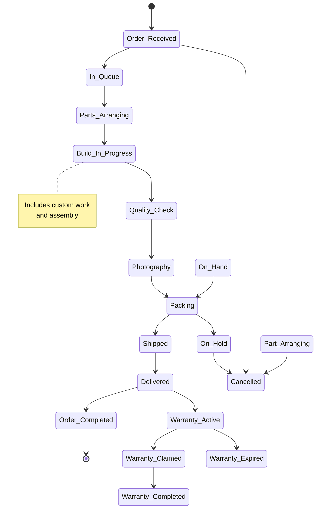
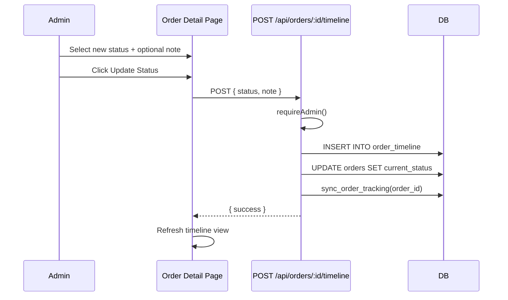

# Order Workflow

## Lifecycle

## Statuses

The system defines 18 order statuses in `src/constants/order-statuses.ts`:

| Key | Label | Stage |
|-----|-------|-------|
| `order_received` | Order Received | Intake |
| `in_queue` | In Queue | Intake |
| `parts_arranging` | Parts Arranging | Production |
| `build_in_progress` | Build In Progress | Production |
| `quality_check` | Quality Check | Production |
| `photography` | Photography | Production |
| `packing` | Packing | Production |
| `shipped` | Shipped | Fulfillment |
| `delivered` | Delivered | Fulfillment |
| `order_completed` | Order Completed | Complete |
| `on_hold` | On Hold | Hold |
| `cancelled` | Cancelled | Complete |
| `warranty_active` | Warranty Active | Warranty |
| `warranty_claimed` | Warranty Claimed | Warranty |
| `warranty_completed` | Warranty Completed | Warranty |
| `warranty_expired` | Warranty Expired | Warranty |

## Service Types

Orders can be one of the following service types:

| Key | Label |
|-----|-------|
| `full_build` | Full Build |
| `assembly_only` | Assembly Only |
| `repair` | Repair |
| `custom_keyboard` | Custom Keyboard |
| `custom_mouse` | Custom Mouse |
| `other` | Other |

## Adding Timeline Updates

Admin adds timeline entries via the order detail page:

1. Select the new status from a dropdown
2. Optionally add a note
3. Click **Update Status**

This triggers:
1. Insert into `order_timeline` table
2. Update `orders.current_status`
3. Call `sync_order_tracking()` to refresh the public view

## Public Tracking Sync

After every status update, the `sync_order_tracking()` PostgreSQL function rebuilds the denormalized `order_tracking` row. This ensures the customer's tracking page reflects the latest status without any additional infrastructure.

## Warranty Flow

When an order reaches `Order Completed` status, a warranty record can be associated:

1. Warranty is typically 1 year from delivery date
2. Statuses: `warranty_active` → `warranty_claimed` / `warranty_expired`
3. Warranty information is visible to the customer on the tracking page
