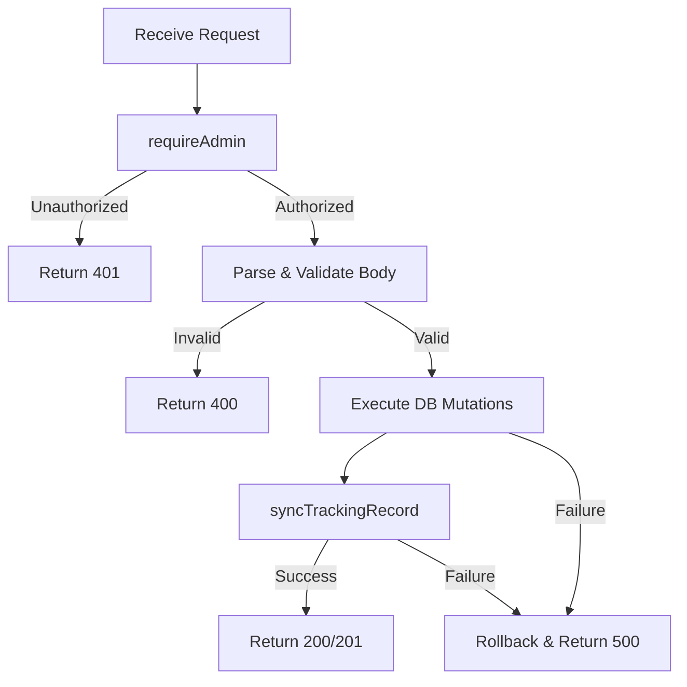

# API Routes

All API routes are defined under `src/app/api/`. Every mutation endpoint requires admin authentication via `requireAdmin()`.

## Authentication

All endpoints (except `GET` for public data) require the caller to be authenticated as an admin. Authentication is handled by `requireAdmin()` (`src/lib/api-auth.ts`):

```typescript
const { user, error } = await requireAdmin();
if (error) return error; // 401 Unauthorized
```

The session is read from HTTP-only cookies set by `@supabase/ssr`.

## Error Response Format

All errors return:

```json
{
  "success": false,
  "error": "Error message"
}
```

## Endpoints

---

### POST /api/orders

Create a new order.

**Authentication:** Required (admin)

**Request Body:**

```json
{
  "customer": {
    "name": "John Doe",
    "email": "john@example.com",
    "phone": "+91-9876543210",
    "discord_username": "johndoe#1234"
  },
  "address": {
    "street_address": "123 Main St",
    "city": "Mumbai",
    "state": "Maharashtra",
    "pincode": "400001"
  },
  "service_type": "full_build",
  "products": [
    { "type": "keyboard", "name": "KBDFans 67 Lite", "sort_order": 0 }
  ],
  "services": [
    { "service_id": "full_assembly", "quantity": 1 }
  ],
  "custom_work": [
    { "name": "Custom cable", "category": "keyboard", "description": "Custom length", "price": 1500, "sort_order": 0 }
  ],
  "billing_details": {
    "extraCharges": [{ "label": "Rush fee", "amount": 500 }],
    "flatDiscount": 0,
    "percentageDiscount": 0,
    "taxPercentage": 18
  },
  "shipping_info": {
    "shipping_cost": 100,
    "packaging_cost": 50,
    "estimated_dispatch_date": "2026-07-15",
    "estimated_delivery_date": "2026-07-20"
  },
  "payment": {
    "payment_status": "pending",
    "amount_paid": 0
  },
  "customer_message": "Please add extra foam",
  "admin_customer_notes": [
    { "text": "Customer requested blue switches" }
  ],
  "admin_internal_notes": [
    { "text": "Discount approved by Hardik" }
  ]
}
```

**Response** `201 Created`:

```json
{
  "success": true,
  "order": {
    "id": "uuid",
    "order_number": "KF-1A2B3C",
    "customer_id": "uuid",
    "address_id": "uuid"
  }
}
```

**Errors:**

| Status | Condition |
|--------|-----------|
| 400 | Missing required fields |
| 401 | Not authenticated |
| 500 | Database error |

---

### PATCH /api/orders/[id]

Update an existing order. Only sends changed fields.

**Authentication:** Required (admin)

**Request Body:** (partial — only include changed sections)

```json
{
  "customer": { "name": "Jane Doe" },
  "current_status": "build_in_progress",
  "products": [
    { "type": "keyboard", "name": "Mode Sonnet", "sort_order": 0 }
  ],
  "billing_details": {
    "flatDiscount": 1000
  }
}
```

**Response** `200 OK`:

```json
{
  "success": true,
  "id": "uuid"
}
```

**Errors:**

| Status | Condition |
|--------|-----------|
| 401 | Not authenticated |
| 404 | Order not found |
| 500 | Database error |

---

### DELETE /api/orders/[id]

Soft-delete an order (sets `is_deleted = true`).

**Authentication:** Required (admin)

**Response** `200 OK`:

```json
{
  "success": true,
  "id": "uuid"
}
```

**Errors:**

| Status | Condition |
|--------|-----------|
| 401 | Not authenticated |
| 404 | Order not found |

---

### POST /api/orders/[id]/timeline

Add a timeline entry to an order.

**Authentication:** Required (admin)

**Request Body:**

```json
{
  "status": "build_in_progress",
  "note": "Build started — waiting on switches"
}
```

**Response** `200 OK`:

```json
{
  "success": true
}
```

**Errors:**

| Status | Condition |
|--------|-----------|
| 400 | Missing status |
| 401 | Not authenticated |
| 404 | Order not found |

---

## Internal Flow

Every mutation endpoint follows this pattern:



## Helper Functions

Located in `src/lib/api-response.ts`:

| Function | Usage |
|----------|-------|
| `jsonSuccess(data, status)` | Return `{ success: true, ...data }` |
| `jsonError(message, status)` | Return `{ success: false, error }` |
| `jsonUnauthorized()` | Shorthand for 401 error |
| `jsonNotFound()` | Shorthand for 404 error |
| `jsonServerError()` | Shorthand for 500 error |
| `parseJsonBody(body)` | Safely parse JSON request body |

## Tracking Sync

After every mutation, `syncTrackingRecord(orderId)` (`src/lib/tracking-sync.ts`) is called:

```typescript
export async function syncTrackingRecord(orderId: string) {
  const { error } = await supabaseAdmin.rpc('sync_order_tracking', { p_order_id: orderId });
  if (error) throw error;
}
```

This ensures the public tracking view is always current.
