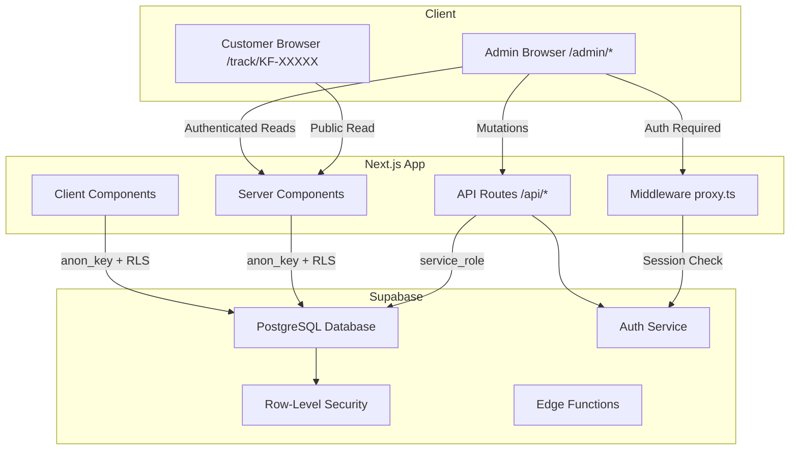
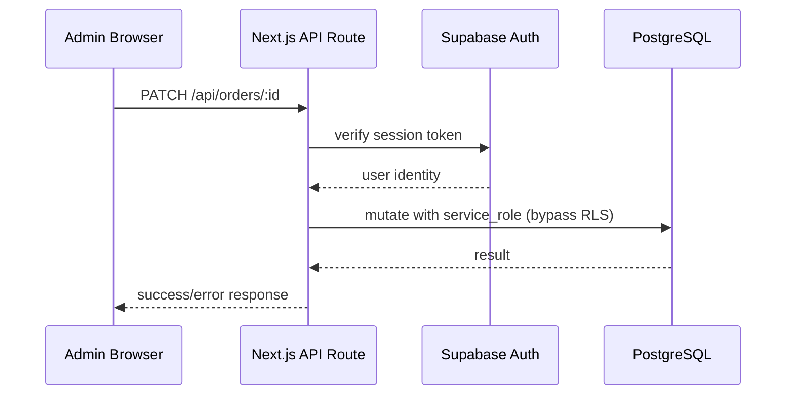
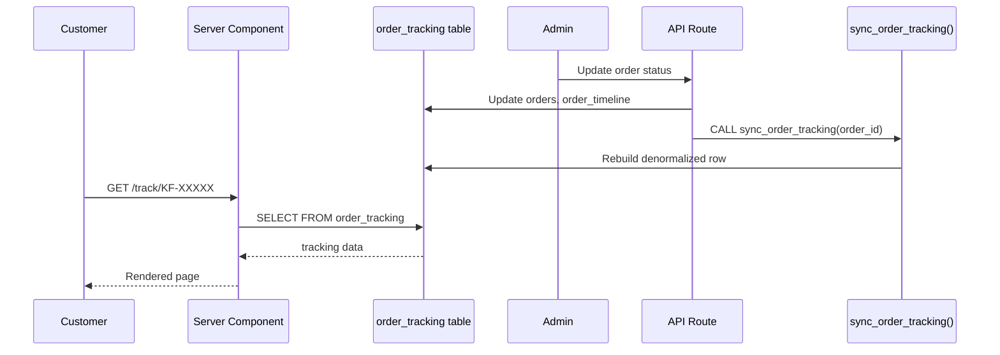
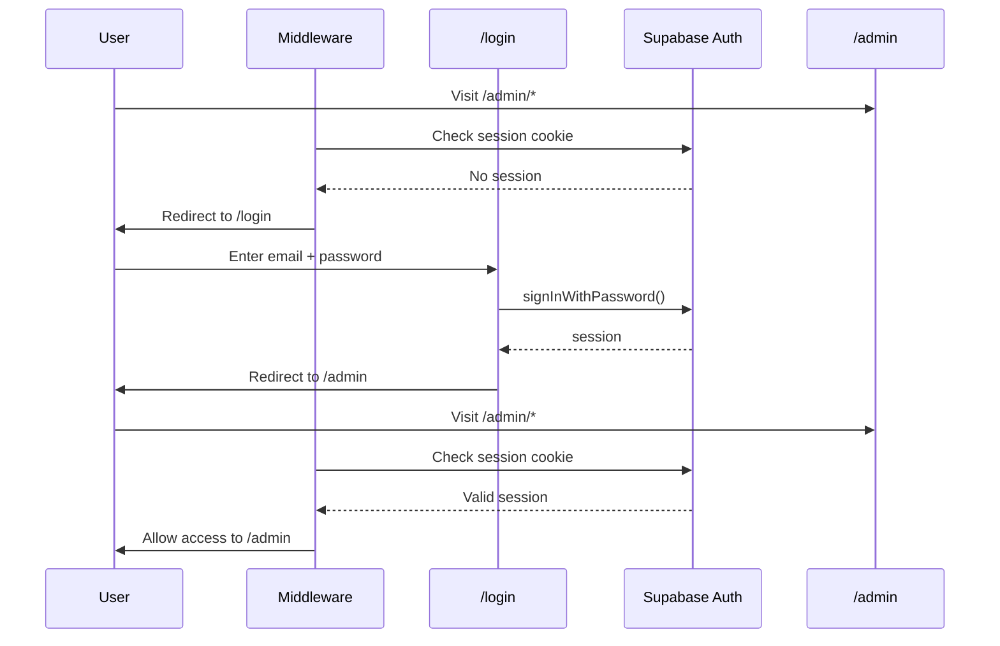

# Architecture

## High-Level Overview



## Next.js Architecture

The project uses the **Next.js App Router** with a mix of Server and Client Components.

### App Router Structure

```
src/app/
├── page.tsx              # Landing page (Client)
├── layout.tsx            # Root layout (Server)
├── login/page.tsx        # Admin login (Client)
├── admin/
│   ├── layout.tsx        # Admin layout with nav (Server)
│   ├── page.tsx          # Dashboard (Server)
│   ├── loading.tsx       # Dashboard loading skeleton (Client)
│   ├── error.tsx         # Admin error boundary (Client)
│   ├── new/page.tsx      # Create order form (Client)
│   └── orders/
│       ├── page.tsx      # All orders list (Server)
│       └── [orderNumber]/
│           └── page.tsx  # Order detail/edit (Client)
├── track/
│   └── [orderNumber]/
│       ├── page.tsx      # Customer tracking (Server)
│       ├── loading.tsx   # Tracking loading (Client)
│       └── error.tsx     # Tracking error boundary (Client)
└── api/
    └── orders/
        ├── route.ts      # POST - Create order
        └── [id]/
            ├── route.ts  # PATCH/DELETE - Update/archive order
            └── timeline/
                └── route.ts  # POST - Add timeline update
```

### Server Components

Pages like `/admin`, `/admin/orders`, and `/track/[orderNumber]` are **Server Components**. They fetch data on the server using the Supabase server client and render HTML directly. This means:

- No client-side JavaScript for data fetching
- Direct database queries without API waterfalls
- Automatic streaming with `loading.tsx` boundaries

### Client Components

Interactive pages like `/admin/new`, `/admin/orders/[orderNumber]`, and `/login` are **Client Components** (`"use client"`). They use:

- Client-side Supabase for real-time form interactions
- Client-side state management for complex forms
- Client-side animations (animejs)

## API Routes

All mutations go through API routes that use the **service role key** (`supabaseAdmin`) to bypass RLS:



Every mutation API route:
1. Authenticates the admin via `requireAdmin()` (checks Supabase session)
2. Performs the mutation using the service role client (bypasses RLS)
3. Calls `syncTrackingRecord()` to sync the public tracking view
4. Returns a JSON response

## Supabase Integration

### Client Types

| Client | Location | Key | RLS | Use Case |
|--------|----------|-----|-----|----------|
| Browser Client | `lib/supabase/client.ts` | `anon_key` | Enforced | Client-side reads in tracking & admin pages |
| Server Client | `lib/supabase/server.ts` | `anon_key` | Enforced | Server-side reads in Server Components |
| Admin Client | `lib/supabaseAdmin.ts` | `service_role_key` | Bypassed | All API route mutations |
| Middleware | `lib/supabase/middleware.ts` | `anon_key` | Enforced | Session management |

### Data Flow for Order Tracking



## Authentication Flow



## Security Architecture

See [SECURITY.md](./SECURITY.md) for a detailed breakdown.

Key principles:
- **RLS for reads** — All client-side queries go through RLS policies
- **Service role for writes** — All API mutations use the service role key
- **Admin authentication** — `requireAdmin()` checks Supabase Auth session on every API request
- **Defense in depth** — `is_admin()` PostgreSQL function is SECURITY DEFINER for RLS, but API routes also check auth server-side
