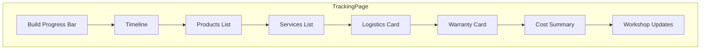
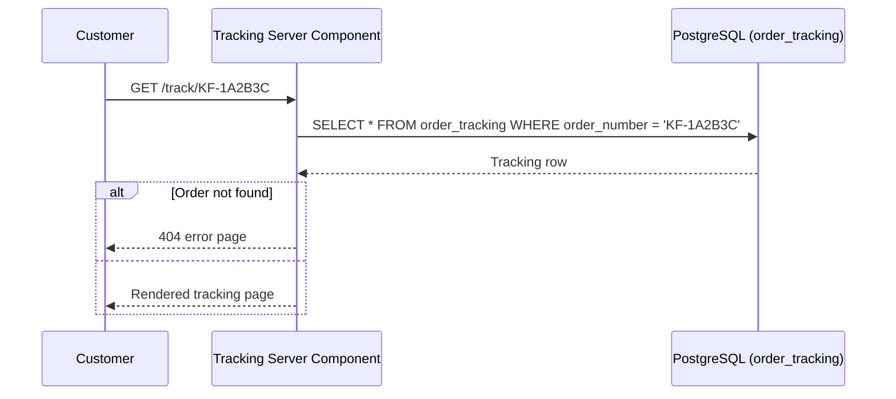

# Customer Tracking Page

**Route:** `/track/[orderNumber]`

**Type:** Server Component (`force-dynamic`)

The tracking page is publicly accessible — no authentication required. Customers enter their order number (e.g., `KF-1A2B3C`) on the landing page and are redirected to their tracking page.

## Page Sections

### Build Progress

`BuildProgress.tsx`

A visual progress indicator showing the current production stage. Stages are grouped into phases:

1. **Order Received** → Order Received
2. **In Queue** → In Queue
3. **Production** → Parts Arranging → Build In Progress → Quality Check → Photography → Packing
4. **Shipping** → Shipped → Delivered
5. **Completed** → Order Completed

The progress bar fills proportionally based on the current status position within the full lifecycle.

### Timeline

`RealTimeline.tsx`

A chronological, scrollable timeline showing all status changes. Each entry displays:

- Status name (with color-coded badge)
- Note from the admin (if any)
- Timestamp (formatted for Indian timezone)

Entries are ordered newest-first.

### Products List

`ProductsList.tsx`

Lists all products in the order with type and name.

### Services List

`ServicesList.tsx`

Displays selected services with quantities.

### Logistics Card

`LogisticsCard.tsx`

| Field | Display |
|-------|---------|
| Shipping Status | Badge (color-coded) |
| Courier | Name |
| Tracking Number | Clickable link |
| Tracking URL | External link to courier |
| Estimated Dispatch | Date |
| Estimated Delivery | Date |

### Warranty Card

`WarrantyCard.tsx`

| Field | Display |
|-------|---------|
| Warranty Status | Badge (color-coded) |
| Warranty Start | Date |
| Warranty End | Date |

### Cost Summary

`CostSummary.tsx`

A breakdown of order costs:

- Services total
- Custom work total
- Extra charges
- Discounts (flat + percentage)
- Tax
- Shipping & packaging
- **Grand total**
- Amount paid
- **Balance remaining**

### Workshop Updates

`WorkshopUpdates.tsx`

Displays admin-to-customer notes — messages from the KeebForge team visible on the tracking page.

## Data Source

The tracking page queries the `order_tracking` table directly via a Server Component. This denormalized table is kept in sync by `sync_order_tracking()` after every admin mutation.

## Loading State

A full-page loading skeleton is shown via `loading.tsx` while the Server Component fetches data.

## Error State

If the database query fails, `error.tsx` displays an error message with a **Try Again** button.
