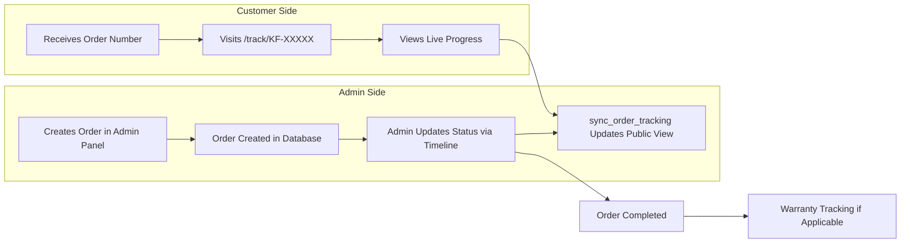

# Project Overview

KeebForge Order Tracking is a web application that provides real-time order tracking for customers of KeebForge, a custom mechanical keyboard workshop based in India. It also serves as the internal order management system for the workshop's administrative team.

## What It Does

When a customer places an order (through external channels), an admin creates a corresponding order record in the system. The customer receives a unique order number (e.g., `KF-1A2B3C`) which they can use on the public tracking page to monitor their order's progress through the workshop pipeline.

For the admin team, the system provides a full dashboard with KPIs, revenue analytics, order creation and editing, timeline management, and customer communication tools.

## Customer Tracking System

The public tracking page (`/track/[orderNumber]`) displays:

- **Build Progress** — A visual progress indicator showing the current stage
- **Timeline** — A chronological log of all status updates with timestamps
- **Products** — List of keyboard products and components ordered
- **Services** — Selected services (assembly, programming, etc.)
- **Logistics** — Shipping status, tracking number, courier info, estimated delivery
- **Warranty** — Warranty status, start/end dates
- **Cost Summary** — Billed items, discounts, tax, and total

## Admin Dashboard

The admin panel (`/admin/*`) provides:

- **Dashboard** — KPI cards (total orders, revenue, pending, warranty cases), production overview chart, revenue analytics
- **All Orders** — Searchable, filterable table of all non-deleted orders
- **Order Detail** — Full order view/edit with customer info, products, services, billing, logistics, notes, and timeline
- **Create Order** — Form to create new orders
- **Login** — Secure authentication via Supabase Auth

## Workflow

1. Admin creates an order with customer details, products, services, and billing
2. System generates a unique order number (`KF-` prefix + 6 alphanumeric chars)
3. Admin adds timeline updates as the order progresses through production stages
4. Each timeline update syncs the public-facing `order_tracking` table
5. Customer visits `/track/KF-XXXXX` to see live progress
6. On completion, warranty tracking begins (if applicable)

## Technologies Used

| Technology | Role |
|-----------|------|
| Next.js 16 (App Router) | Full-stack framework — server components, API routes, client components |
| React 19 | UI library |
| TypeScript | Type safety |
| Tailwind CSS v4 | Utility-first styling with custom design tokens |
| Supabase | Backend-as-a-Service — PostgreSQL, Auth, RLS, JS client |
| PostgreSQL 17 | Relational database with 15 tables, views, functions, triggers |
| Recharts | Dashboard charts (bar, line) |
| animejs | Landing page and login page animations |
| Lucide React | Icon library |
| Vercel | Hosting and deployment |
